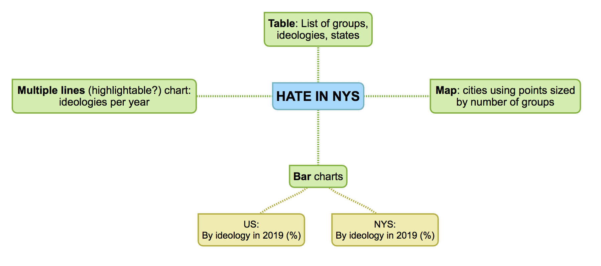
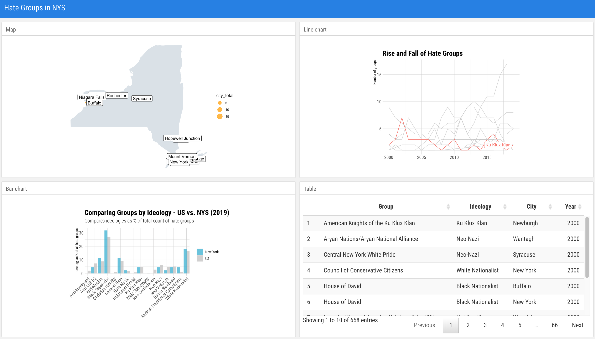

## Prospectus

For the narrative project, I would like to write about and visualize [Southern Poverty Law Center data](https://www.splcenter.org/hate-map) on hate groups over the past decade. I used the same data in my exploratory assignment but this time I will focus on New York State. While the state on a per capita level is in the bottom 15, it nonetheless has more than 40 active groups as of 2019. Where are these groups located? What are the most frequent ideologies followed? Have the most active ideologies changed over the past decade? What might have triggered that to happen? How does NYC compare to the rest of the state? To figure this out, I’m thinking of doing some of these visualizations:

- Maps: US per capita, NYS group locations
- Bar charts: In 2019, by ideologies (in %?) in US and NYS
- Stacked bar chart: For each year (2010-2019) in NYS divided by ideology
- OR multiple line chart
- Table of groups, including their ideology and location

The target audience for this project would be people with an interest or living in New York and/or the state of hate groups in the country, especially given the political climate of the past few years. No previous knowledge would be necessary beyond a familiarity of the concept of hate groups.

In addition to the format of the SPLC data, I will filter and “manipulate” it to get the following (not necessarily using all of it in the end):

- US states + hate groups per capita (data used in exploratory project)
- Geocode NYS locations (at city level) of hate groups
- Number of groups by ideology in NYS by year (2010-2019)
- Number of groups by year in NYC and rest of NYS

## Sketch & Mockup

- Overview on hate groups in 2019, and since 2000, in the US > focus on NYS
   - Bar chart: Compares number of groups belonging to an ideology as % of total hate groups for US and NYS (ex. US has 70 documented anti-LGBTQ groups, or 7.4% of total number of hate groups in the US. NYS has 2 anti-LGBTQ groups, or 4.5% of total number of hate groups in NYS.) > will look at possible ways of visualizing the bars
   - Background on data source: Southern Poverty Law Center and their yearly reports

- Geographical view
   - Clustered in larger cities and surrounding areas, note how 34% of groups are in NYC
   - Map: NYS map of point sizes based on number of groups based in the municipality

- Ideological rise and fall (and rise)
   - Observe which groups are on the rise and which have fallen: What events might have contributed to these changes?
   - Line chart, possibly highlightable and with presidential terms marked in the background: Number of groups belonging to an ideology for each year (2000-2019)

- See specific names and locations of hate groups in the table (Sortable? Drop down?)

## Architecture

[View here](architecture.md)

## [Data](../../data)

File | Place | Description | Year | Data
--- | --- | --- | --- | ---
`map.js` | NYS | Points of group locations | 2019 | `hg_nys_geocoded.csv`, `nys_counties.json`
`table-cities.js` | NYS | Groups by ideology by city | 2019 | `hg.csv`
`bar-compare.js` | US, NYS | % by ideology | 2019 | `hg_ideology_pct.csv`
`table-hg` | NYS | List of all groups + city, ideology | 2019 | `hg.csv`
`lines.js` | NYS | Small multiple line charts of ideology count per year | 2010-2019 | `hg_nys_ideologies.csv`
`bar-ideology.js` | NYS | Groups by ideology | 2000-2019 | `hg_nys_ideologies.csv`
